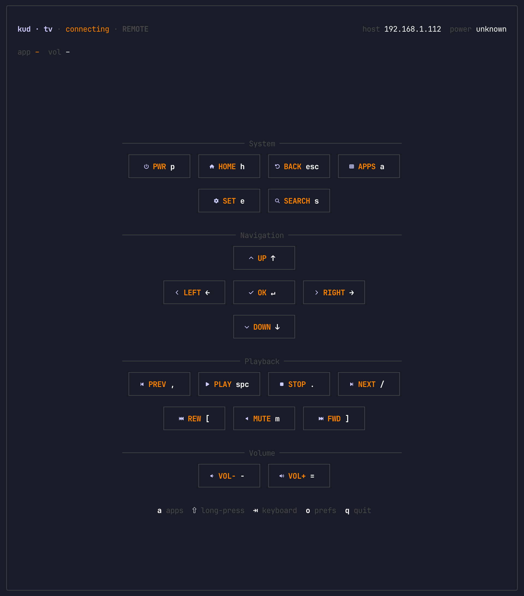

<div align="center">


**Control your Google TV from the terminal with a fast Ink remote**

<a href="https://kud.io/projects/gtv-cli">Website</a> · <a href="https://kud.io/projects/gtv-cli/docs">Documentation</a>

</div>

`gtv` pairs with a Google TV over the Android TV Remote v2 protocol, then lets you drive it from a fullscreen terminal remote or from one-shot shell commands.

## Features

- **Terminal remote** — open a fullscreen Ink UI with system, navigation, playback, and volume controls.
- **First-run pairing** — discover nearby Google TVs, enter the TV PIN, and save the connection for later launches.
- **App launcher** — start apps from an interactive picker or launch names and deep links directly from the CLI.
- **Multiple devices** — list, switch, and unpair saved TVs when you have more than one screen on the network.
- **Keyboard input** — switch into keyboard mode and type into TV text fields through IME injection.
- **Diagnostics** — inspect pairing, connectivity, discovery, and protocol logs with `status`, `doctor`, and `debug`.



## Install

```sh
npm install -g @kud/gtv-cli
```

Requires Node.js 22 or newer.

## Usage

```console
$ gtv                        # open the fullscreen remote, pairing first if needed
$ gtv pair                   # pair or re-pair with a Google TV
$ gtv unpair                 # remove saved pairings
$ gtv discover --select      # scan the network and save a TV
$ gtv devices                # list paired Google TVs
$ gtv switch [name]          # switch the active Google TV
$ gtv status                 # check pairing and connectivity
$ gtv doctor                 # run detailed diagnostics
$ gtv debug                  # stream live protocol logs
$ gtv apps                   # open the app picker
$ gtv app netflix            # launch an app by catalog name
$ gtv app https://example.com # launch a deep link or URL
$ gtv home / back / select   # send navigation keys
$ gtv up / down / left / right
$ gtv vol up|down|mute       # control volume
$ gtv play / stop / next / prev / fwd / rwd
$ gtv power / mute / menu / search / input / sleep / wakeup
$ gtv key <name>             # send any supported key by name
$ gtv --debug <command>      # enable protocol logging for any command
```

Inside the TUI, use arrow keys and Enter to move around the remote. Press `a` for apps, `Tab` for keyboard mode, `o` for preferences, and `q` to quit.

## Development

```sh
git clone https://github.com/kud/gtv-cli.git
cd gtv-cli
npm install
npm run dev
npm run typecheck
npm run build
```

The CLI is written in TypeScript, rendered with Ink, and compiled to `dist/` with tsup.

📚 **Full documentation → [gtv-cli/docs](https://kud.io/projects/gtv-cli/docs)**
